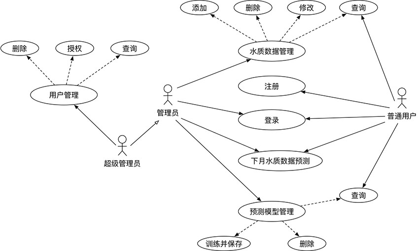
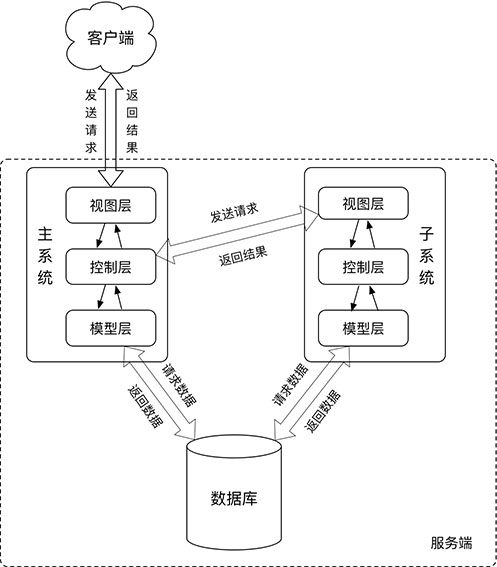
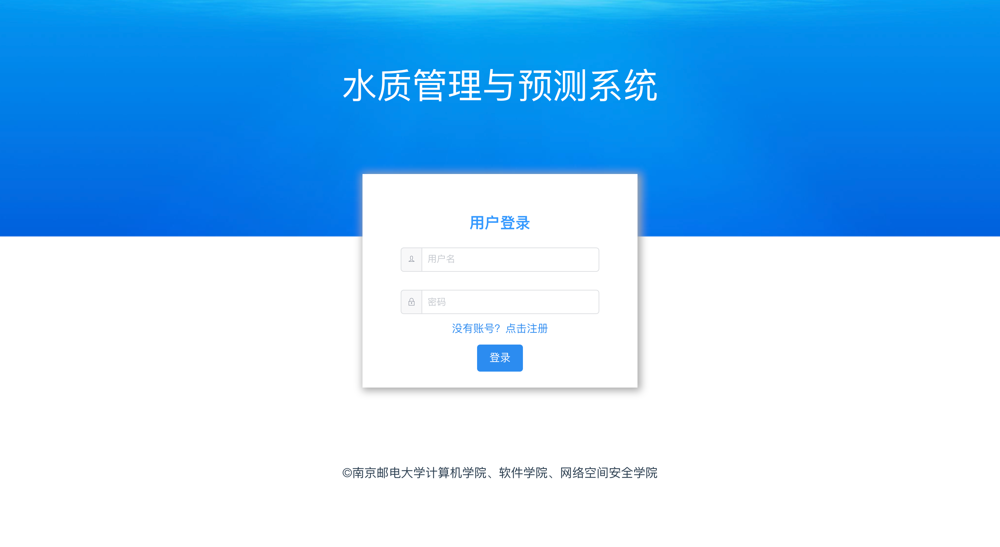
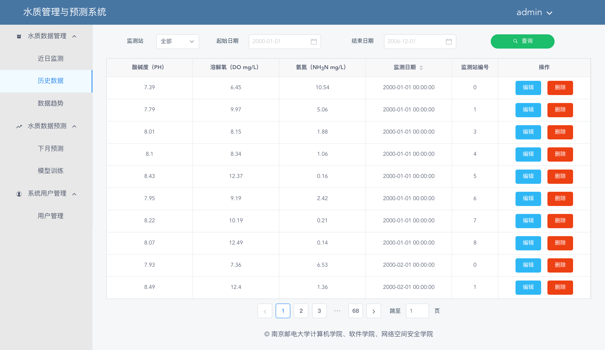
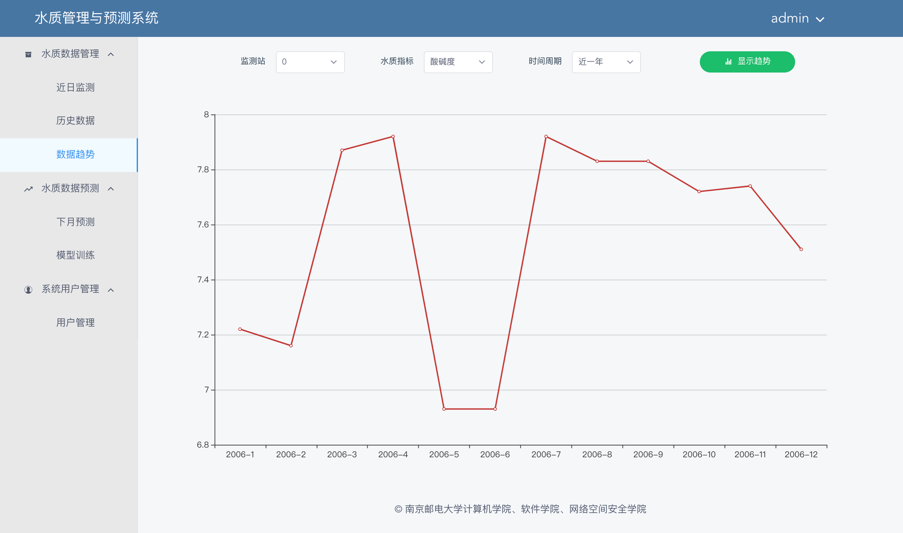
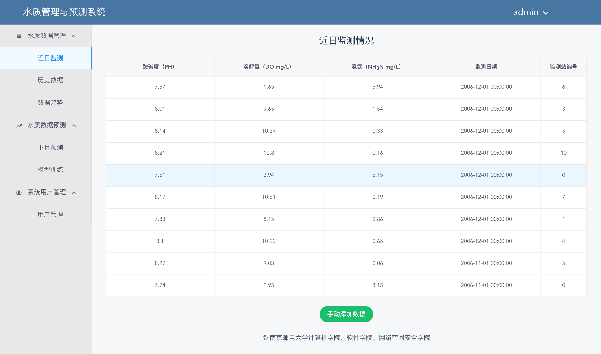
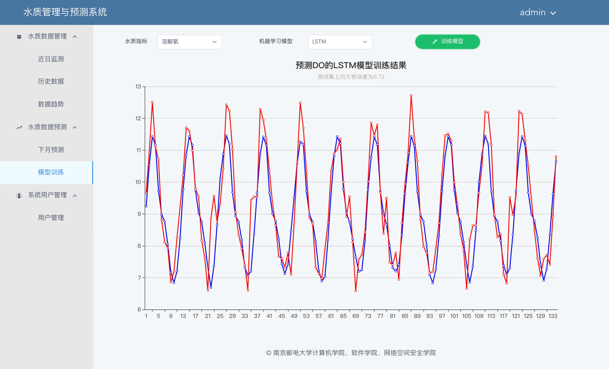
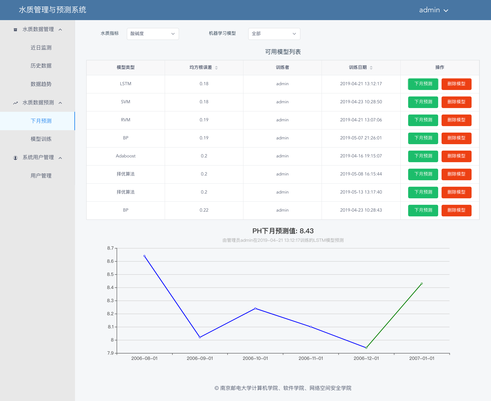
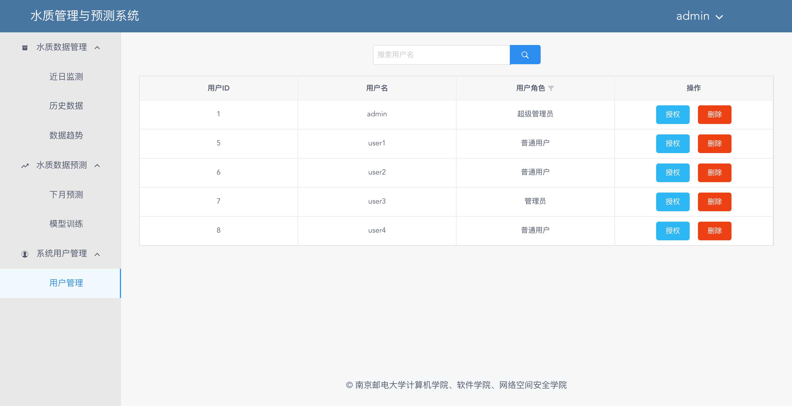

## 系统功能

该系统是一个浏览器/服务器形式的Web应用，具有以下功能：

+ 水质数据管理功能：对水质数据进行增加、查询、修改和删除操作
+ 水质数据预测功能：利用训练好的机器学习模型预测下个月的水质数据，机器学习模型可选LSTM、SVR、RVR、Adaboost、BP神经网络、择优分类
+ 预测模型管理功能：可以对模型进行训练、保存、查询和删除操作
+ 用户注册、登录功能：用户需要注册账户并登录至系统后方可进行操作
+ 用户管理功能：可以对用户进行查询、删除、授权操作，不同级别的用户具有不同的操作权限



## 系统架构

本系统采用分布式架构，将整个系统拆分成主系统和子系统，子系统负责水质数据预测和模型训练及保存等涉及机器学习算法的功能，主系统负责其他一切功能。其中，子系统对客户端是不可见的，客户端执行的一切操作都先向主系统发送请求，如果涉及到数据预测和模型训练主系统再向子系统发送请求，然后将子系统发回的结果返回给客户端。两个系统在物理上相互独立，利用http协议发送JSON格式数据进行数据通信。




## 技术栈

选择前后端分离的开发模式，前端调用后端接口进行数据渲染。

+ 前端技术栈：html、css、javascript、vue.js

+ 主系统技术栈：java、springboot、spring security、spring data jpa

+ 子系统技术栈：python、django、keras

+ 数据库：mysql

## 系统效果

+ 登录页面



+ 历史数据页面



+ 数据趋势页面



+ 近日监测页面



+ 模型训练页面



+ 下月预测页面



+ 用户管理页面




## 系统配置及运行

本系统分为四个部分：数据库，水质预测系统（WQPS），水质管理系统（WQMS）和前端，需要分别配置。

### 数据库

+ 进入mysql，建立一个名叫water的数据库

+ 依次执行database文件夹中的sql代码文件，进行数据表的建立及数据的插入

  ```
  mysql –u用户名 –p密码 –D数据库名< sql脚本文件路径全名
  ```


### 水质预测系统

+ 安装requirements.txt中的所有依赖包

  ```
  pip install -r requirements.txt
  ```

+ 在settings.py中填写数据库的用户名和密码

+ 启动系统

  ```
  python manage.py runserver
  ```

### 水质管理系统

+ 使用IDEA导入WQMS文件夹

+ 该系统是springboot应用，在application.properties中填写数据库的用户名和密码，然后在IDEA中点击绿色运行按钮即可一键启动

### 前端

+ 首先安装node

+ 安装依赖

  ```
  npm install
  ```

+ 运行

  ```
  npm run dev
  ```


## 注意事项

+ 数据库存储的数据使用的是太湖流域的水质数据，一共672条记录，每条记录包含溶解氧、酸碱度、氨氮和时间数据
+ 机器学习模型列表中的择优分类为本人提出，已申请专利：基于择优分类的水质预测方法，国家发明专利，CN108846512A